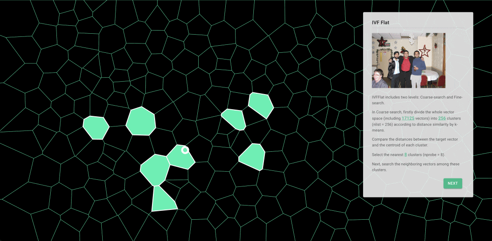
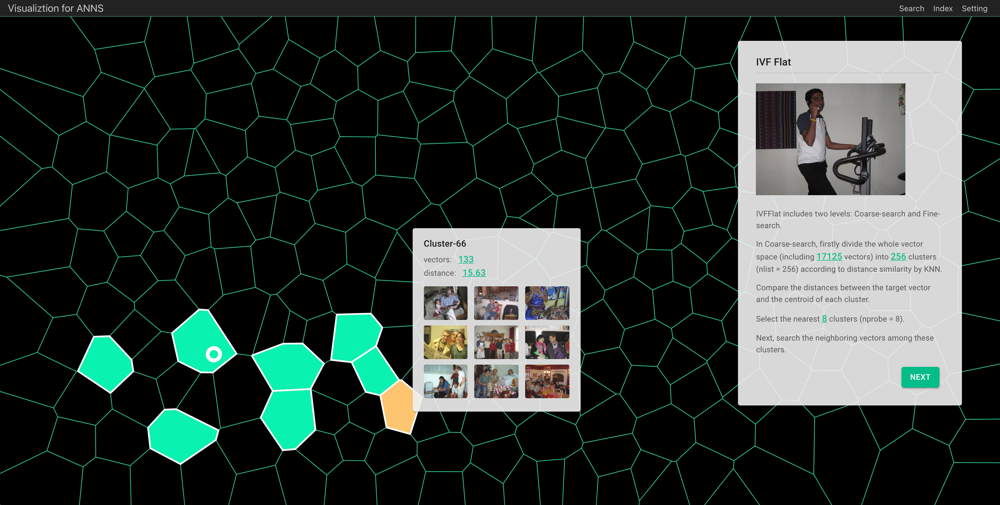
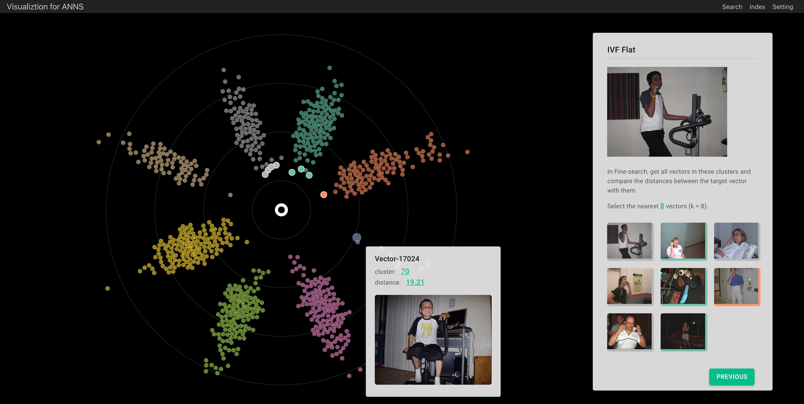
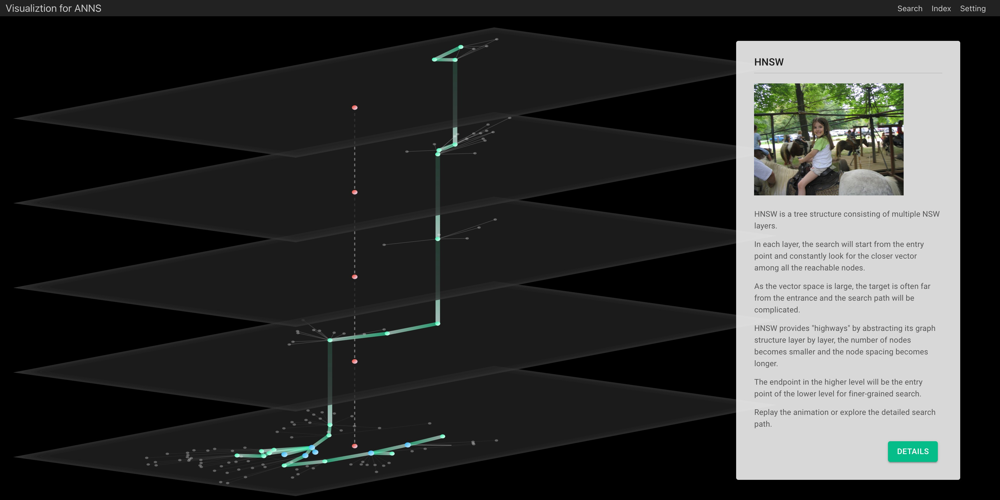

# data-visualization-tool

## Overview

We provide visualizations for the process of ANNS. 
Currently, it supports IVFFlat and HNSW.

- Backend server
  - Vector data store and mapping
  - Index building / search
  - Projection utils
- Web for visualizations
  - Design for IVFFlat and HNSW
  - Technicals: including voronoi, d3-force-links/radius/collision, DR project methods (pca, mds, t-sne, umap)


## Quick start

### Preparing

- New conda env (python >= 3.6)
```
$ conda create -n myenv python=3.6
$ conda activate myenv
```
- faiss >= 1.7.1 ([Installing Faiss via conda](https://github.com/facebookresearch/faiss/blob/main/INSTALL.md))
```
# CPU-only version
$ conda install -c pytorch faiss-cpu

# GPU(+CPU) version
$ conda install -c pytorch faiss-gpu

# or for a specific CUDA version
$ conda install -c pytorch faiss-gpu cudatoolkit=10.2 # for CUDA 10.2 
```
- hnswlib4vis
  - [Download](https://drive.google.com/file/d/1rApQlIEJwrU6oVAVKqHEYDBX4jdC3YQ0/view?usp=sharing) and install wheel directly.
  - compile C++ to py ([hnswlib4vis](https://github.com/alwayslove2013/hnswlib)).

- Dataset (images and embedding vectors)
  - [images from VOC2012](http://host.robots.ox.ac.uk/pascal/VOC/voc2012/VOCtrainval_11-May-2012.tar)
    - put image_files("VOCdevkit/VOC2012/JPEGImages") to "./server/data/images/"
  - [vectors embedding by ResNet](https://drive.google.com/file/d/1bWLTsN3uiYRKntkf5pOZby6Ygp_zMWxp/view?usp=sharing)
    - put vector.csv to "./server/data/"
  - you can also use your own data including images and embedding vectors.


### Build and Run
- Clone this repo
```
$ git clone git@github.com:zilliztech/data-visualization-tool.git
```
- Run server
```
$ cd server/
$ pip install -r requirements.txt
$ python api.py
```
- Run web
```
$ yarn start
```


## IVFFlat Visualization





The visiting records of vectors in IVFFlat comes from the python api of [faiss](https://github.com/facebookresearch/faiss).
(details on *server/index/faiss_ivf.py*)

## HNSW Visualization




Getting the visiting records of vectors in HNSW comes by modifying the source cpp of [hnswlib](https://github.com/nmslib/hnswlib),
then compiling to python.
(details on [hnswlib4vis]() and *server/index/hnswlib_hnsw.py*)

## Join us

Welcome to Zilliz!

## Acknowledgments

- [faiss](https://github.com/facebookresearch/faiss)
- [hnswlib](https://github.com/nmslib/hnswlib)
- [d3](https://github.com/d3/d3)
